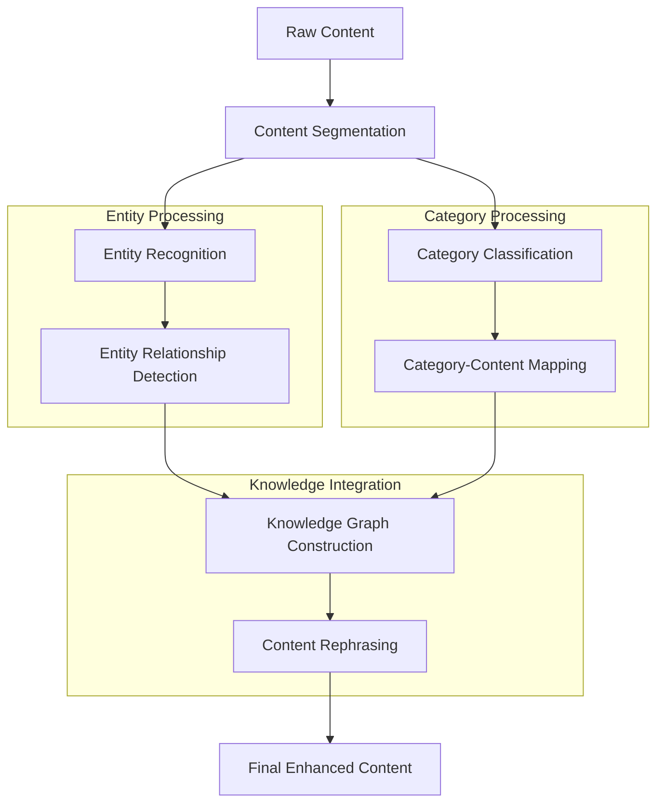
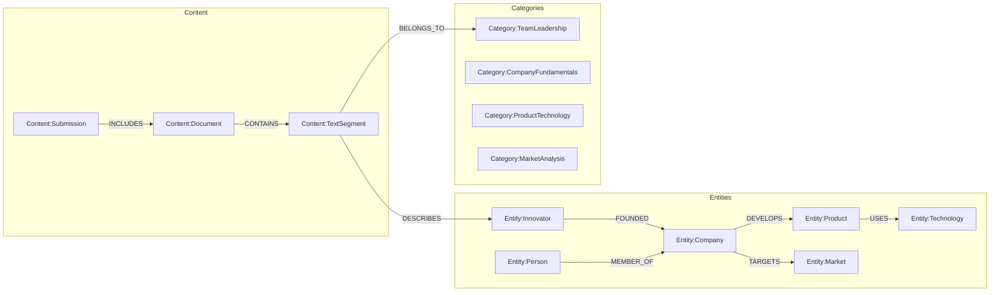
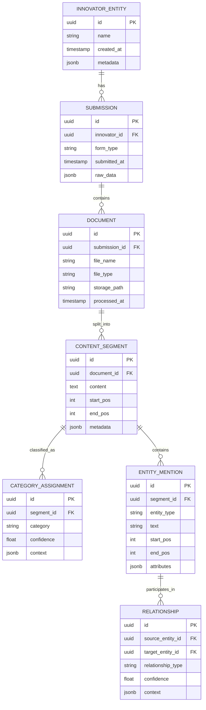

# Ingestion System

## Architecture Overview

The ingestion system follows a pipeline architecture with four main stages:

1. **Form Collection** (`form_collection.py`)
   - Fetches form submissions and files from Firebase
   - Downloads and processes associated files using:
     - Direct URLs
     - Firebase Storage paths
   - Produces raw structured data
   - **Current Challenges:**
     - Some files are not being detected in the recursive search
     - Need to improve file detection logic in nested structures

2. **Content Extraction** (`extract/`)
   - Handles multiple file formats through specialized extractors:
     - Documents (PDF, DOCX, etc.) using Docling
     - Audio files using Whisper large-v3
   - Provides unified content access interface
   - Advanced extraction features:
     - OCR for documents
     - Table structure recognition
     - Audio transcription with timestamps
   - **Current Challenges:**
     - Need to identify and prioritize important text segments
     - Better context preservation needed for categorization

3. **Data Enhancement** (`enhancement.py`)
   - Processes and categorizes extracted content using:
     - Zero-shot classification with BART
     - Named Entity Recognition with SpaCy
   - **Current Challenges:**
     - Need to extract the relevant content for each category and entity for later process and modeling
     - Need better content-to-category mapping and better extraction of entities and relationships to categories and content
     - Better organization of content for "essay" generation

4. **Database Population** (`population.py`)
   - **Status: Not Yet Implemented**
   - Planned features:
     - Intelligent content chunking
     - Category-based organization
     - Relationship mapping
     - Optimization for narrative generation

## Content Categories and Classification

The system processes information into hierarchical domains, with special focus on generating coherent narratives about innovators:

### 1. Team & Leadership
- Founder profiles and backgrounds
- Key team members and expertise
- Advisory board (if exists)
- Academic/research affiliations

### 2. Company Fundamentals
- Basic company information
- Registration details
- Company history and timeline
- Mission and vision
- Physical location(s)

### 3. Product/Technology
- Core technology description
- Product/service details
- Development stage
- Technical architecture
- Unique selling propositions
- IP status and protection strategy

### 4. Market Analysis
- Market size (TAM/SAM/SOM)
- Target market segments
- Competitive landscape
- Market trends and dynamics
- Entry barriers
- Geographic focus

### 5. Business Model
- Revenue streams
- Pricing strategy
- Distribution channels
- Customer acquisition strategy
- Partnership strategy
- Cost structure

### 6. Traction & Validation
- Current customers/users
- Pilot programs
- Letters of Intent (LOIs)
- Key partnerships
- Market validation results
- Revenue metrics

### 7. Financial Information
- Funding requirements
- Use of funds
- Financial projections
- Current runway
- Previous funding rounds
- Key financial metrics

### 8. Development & Execution Plan
- Product roadmap
- R&D milestones
- Go-to-market strategy
- Scaling plans
- Key risks and mitigation strategies

### 9. Legal & Compliance
- IP rights and patents
- Regulatory requirements
- Compliance status
- Legal structure
- Licensing agreements

### 10. Impact & Innovation
- Social/environmental impact
- Innovation aspects
- Technology advantages
- Contribution to the industry
- Alignment with grant objectives

### 11. Supporting Information
- Pitch deck
- Business plan
- Technical documentation
- Financial models
- Team CVs
- Legal documents
- Demo/prototype materials

## Current Challenges and TODOs

1. **File Detection Improvements**
   - Enhance recursive search in nested structures
   - Better handling of various file reference formats
   - Improved error handling and logging

2. **Content Extraction Enhancements**
   - Identify key sections in documents
   - Better preservation of document structure
   - Improved handling of tables and formatted content

3. **Category Classification**
   - Better mapping of content to categories
   - Improved relevance scoring
   - Context preservation across chunks
   - Better handling of cross-category relationships

4. **Narrative Generation**
   - Design database schema for narrative structure
   - Implement intelligent content chunking
   - Develop relationship mapping strategy
   - Create coherent narrative generation logic

## Enhanced Content Processing Architecture



### Enhanced Processing Pipeline

1. **Content Segmentation**
   - Split content into meaningful segments
   - Identify document structure and hierarchy
   - Extract key sections and paragraphs
   - Tools: 
     - SpaCy's sentencizer (with chunking)
     - Custom section detectors
     - **Text Length Handling**:
       - Process documents in chunks of ~100KB
       - Maintain context across chunks
       - Use sliding window approach for cross-chunk entities

2. **Entity Recognition & Processing**
   - Enhanced NER using SpaCy's transformer models
   - Custom entity patterns for startup domain
   - Entity coreference resolution
   - Entity attribute extraction
   - Tools: 
     - SpaCy NER
     - Hugging Face transformers
     - **Long Document Processing**:
       - Parallel processing of chunks
       - Entity consolidation across chunks
       - Cross-reference resolution

3. **LLM Integration**
   - Options for long context processing:
     - Google Vertex AI with Gemini 2.0 (1M token context)
     - Custom chunking with context preservation
     - Hierarchical summarization
   - Tools:
     - Google Cloud Vertex AI SDK
     - Custom context management
     - Spacy-llm for shorter contexts

4. **Implementation Considerations**
   - Chunk Management:
     ```python
     class ChunkManager:
         def split_text(self, text: str, chunk_size: int = 100000) -> List[TextChunk]
         def maintain_context(self, chunks: List[TextChunk]) -> List[ContextualChunk]
         def merge_results(self, chunk_results: List[ChunkResult]) -> CombinedResult
     ```
   
   - Long Context Processing:
     ```python
     class LongContextProcessor:
         def process_with_gemini(self, text: str) -> ProcessedContent
         def process_with_spacy(self, text: str) -> ProcessedContent
         def combine_processors(self, text: str) -> EnhancedContent
     ```

   - Entity Consolidation:
     ```python
     class CrossChunkEntityResolver:
         def track_entities(self, chunks: List[ProcessedChunk]) -> EntityMap
         def resolve_references(self, entity_map: EntityMap) -> ResolvedEntities
         def merge_entities(self, entities: List[Entity]) -> ConsolidatedEntities
     ```

### Enhanced Processing Pipeline

1. **Content Segmentation**
   - Split content into meaningful segments
   - Identify document structure and hierarchy
   - Extract key sections and paragraphs
   - Tools: 
     - SpaCy's sentencizer (with chunking)
     - Custom section detectors
     - **Text Length Handling**:
       - Process documents in chunks of ~100KB
       - Maintain context across chunks
       - Use sliding window approach for cross-chunk entities

2. **Entity Recognition & Processing**
   - Enhanced NER using SpaCy's transformer models
   - Custom entity patterns for startup domain
   - Entity coreference resolution
   - Entity attribute extraction
   - Tools: 
     - SpaCy NER
     - Hugging Face transformers
     - **Long Document Processing**:
       - Parallel processing of chunks
       - Entity consolidation across chunks
       - Cross-reference resolution

3. **LLM Integration**
   - Options for long context processing:
     - Google Vertex AI with Gemini 2.0 (1M token context)
     - Custom chunking with context preservation
     - Hierarchical summarization
   - Tools:
     - Google Cloud Vertex AI SDK
     - Custom context management
     - Spacy-llm for shorter contexts

4. **Implementation Considerations**
   - Chunk Management:
     ```python
     class ChunkManager:
         def split_text(self, text: str, chunk_size: int = 100000) -> List[TextChunk]
         def maintain_context(self, chunks: List[TextChunk]) -> List[ContextualChunk]
         def merge_results(self, chunk_results: List[ChunkResult]) -> CombinedResult
     ```
   
   - Long Context Processing:
     ```python
     class LongContextProcessor:
         def process_with_gemini(self, text: str) -> ProcessedContent
         def process_with_spacy(self, text: str) -> ProcessedContent
         def combine_processors(self, text: str) -> EnhancedContent
     ```

   - Entity Consolidation:
     ```python
     class CrossChunkEntityResolver:
         def track_entities(self, chunks: List[ProcessedChunk]) -> EntityMap
         def resolve_references(self, entity_map: EntityMap) -> ResolvedEntities
         def merge_entities(self, entities: List[Entity]) -> ConsolidatedEntities
     ```

## Database Architecture

### Graph Database Schema (Neo4j)



### SQL Database Schema (PostgreSQL)



### NoSQL Database Schema (MongoDB)

```javascript
// Innovator Collection
{
  _id: ObjectId,
  name: String,
  metadata: {
    created_at: Date,
    last_updated: Date,
    status: String
  },
  current_state: {
    processing_stage: String,
    completion_status: Object
  },
  extracted_data: {
    team_leadership: [{
      content: String,
      confidence: Number,
      sources: [{ type: String, id: String }]
    }],
    company_fundamentals: [...],
    product_technology: [...],
    // ... other categories
  },
  relationships: [{
    type: String,
    target: {
      type: String,
      id: ObjectId
    },
    confidence: Number,
    context: Object
  }]
}

// ProcessedContent Collection
{
  _id: ObjectId,
  innovator_id: ObjectId,
  document_type: String,
  content_type: String,
  segments: [{
    text: String,
    position: {
      start: Number,
      end: Number
    },
    categories: [{
      name: String,
      confidence: Number
    }],
    entities: [{
      text: String,
      type: String,
      attributes: Object
    }]
  }],
  metadata: {
    processed_at: Date,
    processor_version: String,
    confidence_scores: Object
  }
}

// EntityKnowledgeBase Collection
{
  _id: ObjectId,
  entity_type: String,
  name: String,
  aliases: [String],
  attributes: {
    type_specific_fields: Object,
    confidence: Number
  },
  relationships: [{
    type: String,
    target_entity: ObjectId,
    confidence: Number,
    supporting_evidence: [{
      source_type: String,
      source_id: ObjectId,
      text_segment: String
    }]
  }],
  temporal_data: [{
    timestamp: Date,
    attribute_changes: Object,
    source: Object
  }]
}
```

### Database Usage Patterns

1. **Graph Database (Neo4j)**
   - Primary use: Relationship navigation and knowledge graph queries
   - Key operations:
     - Entity relationship traversal
     - Pattern matching
     - Semantic connections
     - Knowledge graph exploration

2. **SQL Database (PostgreSQL)**
   - Primary use: Structured data and transaction management
   - Key operations:
     - CRUD operations on core entities
     - Document and segment tracking
     - Category and entity mention management
     - Relationship record keeping

3. **NoSQL Database (MongoDB)**
   - Primary use: Flexible data storage and rapid retrieval
   - Key operations:
     - Raw content storage
     - Processed content caching
     - Entity knowledge base
     - Temporal data tracking

### Integration Points

1. **Cross-Database References**
   ```python
   class DatabaseReference:
       sql_id: UUID
       graph_id: str
       nosql_id: ObjectId
       reference_type: str
   ```

2. **Synchronization Patterns**
   ```python
   class DatabaseSyncManager:
       def sync_entity(self, entity_id: str):
           sql_data = sql_db.get_entity(entity_id)
           graph_db.update_node(entity_id, sql_data)
           nosql_db.update_document(entity_id, sql_data)
   ```

3. **Query Coordination**
   ```python
   class CrossDatabaseQueryManager:
       def get_entity_with_relationships(self, entity_id: str):
           base_data = sql_db.get_entity(entity_id)
           relationships = graph_db.get_relationships(entity_id)
           enriched_data = nosql_db.get_entity_knowledge(entity_id)
           return self.merge_results(base_data, relationships, enriched_data)
   ```
